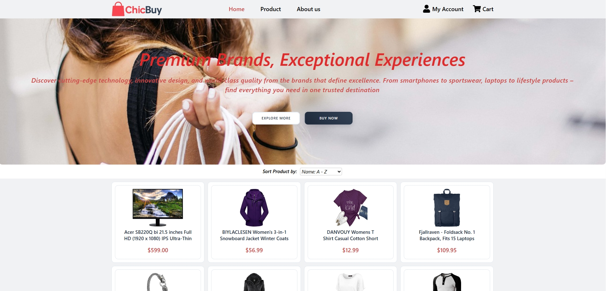
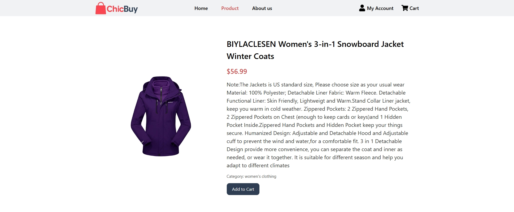
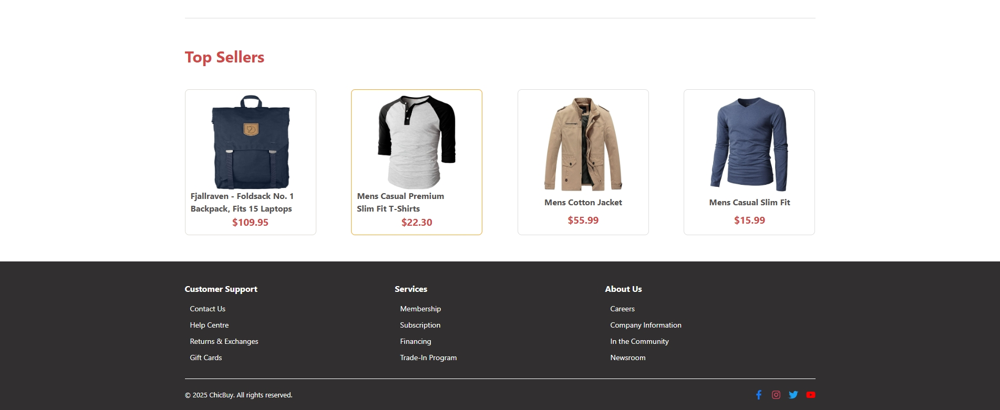
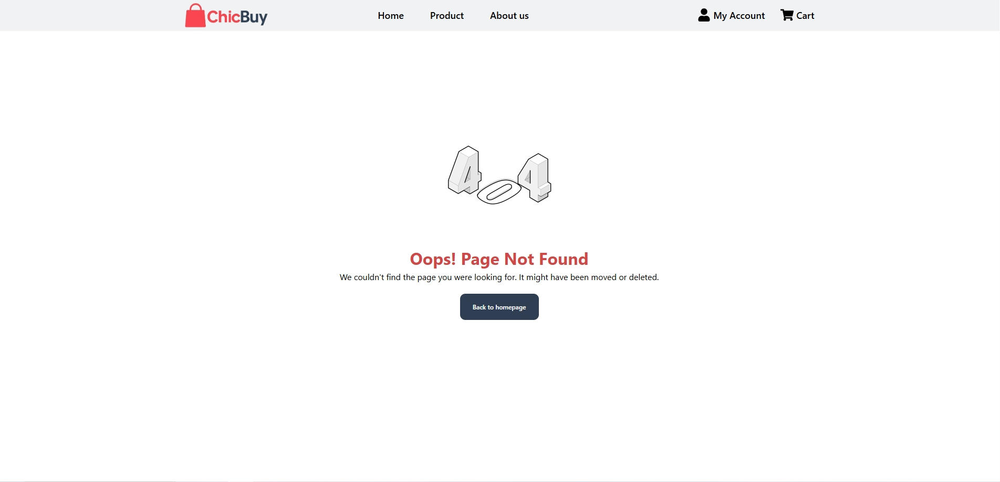

# 🛒 Online Store Template

ChicBuy is a stylish and user-friendly online store built with React.  
It provides users with a seamless shopping experience by showcasing a wide variety of products fetched dynamically from the FakeStore API.  
Users can browse, filter, and sort products on the Home page, view detailed product information.  
The site is fully responsive and features smooth navigation with meaningful error handling for invalid routes.

---

## 🔧 Features

- ✅ Built with **React** and styled with modern CSS
- ✅ Uses **axios** to fetch products from the FakeStore API
- ✅ Fully functional **multi-page** application with routing
- ✅ Component-based structure (Header, Banner, Gallery, Footer, etc.)
- ✅ Error handling with a custom **404 NotFound** page
- ✅ Product filtering and sorting (by name, price)
- ✅ Dynamic product detail page with similar product gallery

---

## 📄 Pages

**Home Page** 
- Displays product list with filtering/sorting options

---

**Product Page**
- Shows detailed product info (image, price, description, etc.) + related items

---

**NotFound Page**
- Shown when user navigates to an invalid URL (404 page)

---

## 🚀 Technologies

- [React](https://reactjs.org/)
- [React Router DOM](https://reactrouter.com/)
- [Axios](https://axios-http.com/)
- [FakeStore API](https://fakestoreapi.com)

---

## 📦 Getting Started

- **Clone the repo**
   - git clone https://github.com/your-username/your-repo-name.git
   - cd your-repo-name

- **Install dependencies**
   - npm install

- **Start the development server**
   - npm start